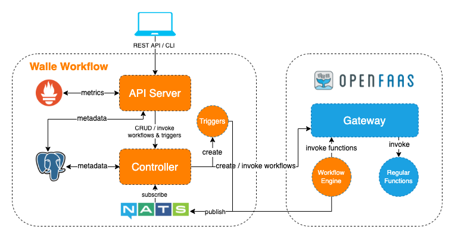

# Walle Serverless Workflow

## Overview

Walle is an open-source, vendor-neutral and cloud-native serverless workflow management system.


> The above are screenshots of the Walle web UI.

## Architecture



## Workflow Example
```yaml
version: 1.0
name: example-workflow
desc: Example Workflow
triggers:
- type: http
  name: http-trigger
  async: true
tasks:
# task-1, no dependency
- name: task-1
  type: http
  url: http://localhost:8083/function/sleep
  timeout: 3s
# task-2, no dependency
- name: task-2
  type: http
  url: http://localhost:8083/function/sleep
  timeout: 3s
# task-3, depends on task-1 and task-2, should be run after them
- name: task-3
  type: http
  url: http://localhost:8083/function/sleep
  method: GET
  retry: 3
  timeout: 3s
  depends: [task-1, task-2]
# task-4, only depends on task-1, should be immediately run after task-1
- name: task-4
  type: http
  url: http://localhost:8083/function/sleep
  timeout: 3s
  depends: [task-1]
```