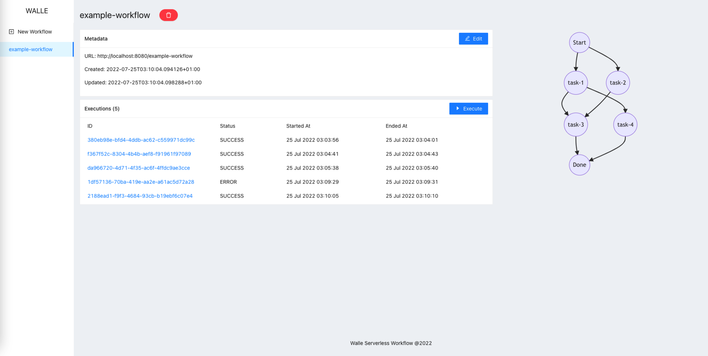
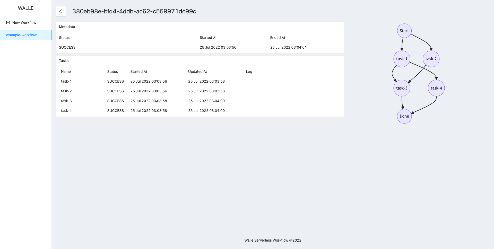
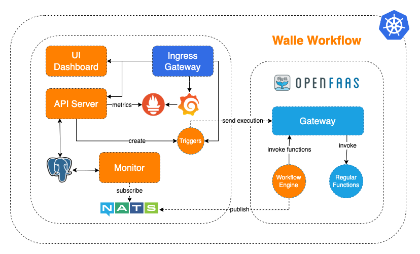

# Walle Serverless Workflow

## Overview

Walle is an open-source, vendor-neutral and cloud-native serverless workflow management system.





## Quick Start

### Prerequisite

- Kubernetes

- OpenFaaS deployed on your Kubernetes

> [OpenFaaS Deployment guide for Kubernetes](https://docs.openfaas.cOpenfaasom/deployment/kubernetes)

### Deploy Workflow Engine on OpenFaaS

```shell
export OPENFAAS_GATEWAY=XXX
faas-cli deploy -f walle-engine.yml -g $OPENFAAS_GATEWAY
```

### Deploy Other Components on Kubernetes

```shell
chmod +x install.sh
./install.sh
```

### Get UI Dashboard URL

```shell
kubectl get ingress -n walle

NAME              CLASS   HOSTS   ADDRESS        PORTS   AGE
gateway-ingress   nginx   *       192.168.64.2   80      10h
```

Open `ADDRESS` in your browser

## Workflow Example
```yaml
name: example-workflow
desc: Example Wrokflow
triggers:
- type: http
  name: http-trigger
  async: true
tasks:
- name: task-1 # task name
  type: http # task type
  url: http://example.com/api/task-1 # the cloud function URL
  method: GET # HTTP method
  headers: # HTTP headers
  - name: Content-Type
    value: application/json
  body: {"message": "Hello Walle!"} # HTTP body
  retry: 3 # max retry times if the task failed
  timeout: 10s # max request timeout
  depends: [] # dependency list
- name: task-2 # Task 2, no dependency
  url: http://example.com/api/task-2
- name: task-3
  url: http://example.com/api/task-3
  depends: [task-1, task-2] # depends on both Task 1 and Task 2, should be run after them
- name: task-4
  url: http://example.com/api/task-4
  depends: [task-1] # Only depends on Task 1 and should be immediately run after Task 1
```

## Architecture

